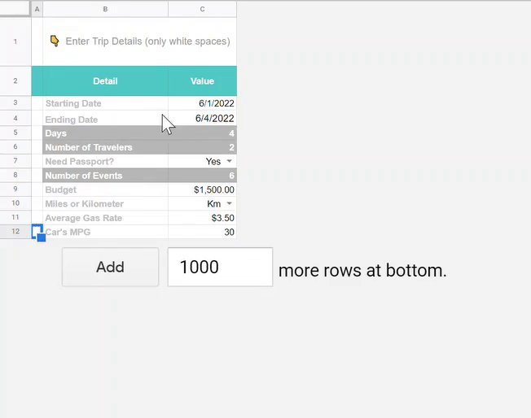
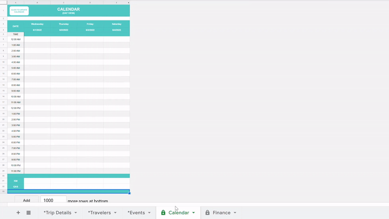
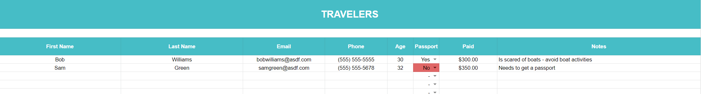
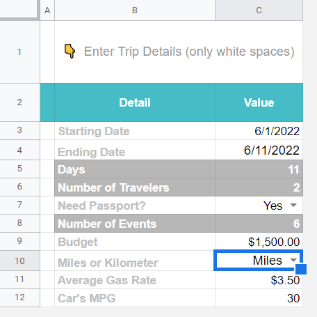
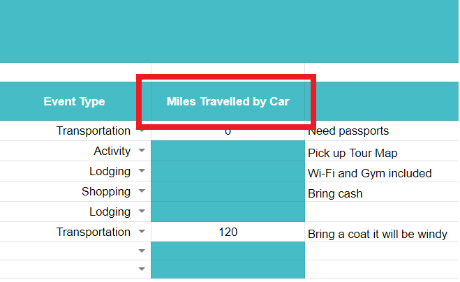
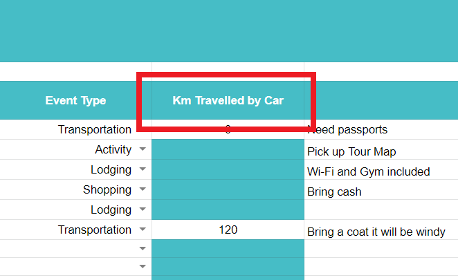
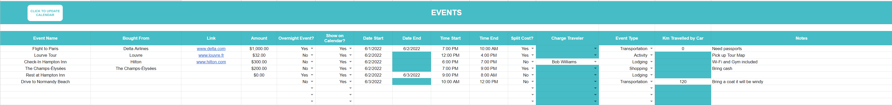

# trip-planner
[](https://github.com/tmchilvers/trip-planner) **|**  v.01.01 **|  Author:** [Tristan Chilvers](https://www.tristanchilvers.com/) **| License:** [MIT License](LICENSE).

<br>
<p align="center"><b>A SET OF GOOGLE CUSTOM FUNCTIONS FOR DYNAMIC CALENDAR & FINANCE SHEETS</b></p>

---

<br>

For my vacations, I often times create a trip outline with Google Sheets. These are rough calendar outlines with every event *manually* inputted and adjusted to fit into the calendar - way too slow and tedious!
<br><br>

While there are many great vacation planners online, I wanted to focus on two qualities for my trip planner: 
<br><p align="center">
  <ins><b>Automated</ins></b> and <ins><b>Dynamic</ins></b> Calendar & Finance Functionality
</p>

<br>

---

# SHEETS
<p align="center"><b>DETAILED EXPLAINATION FOR EACH SHEET</b></p>

          [• TRIP DETAILS](#trip-details)
    [• TRAVELERS](#travelers)
    [• EVENTS](#events)
    [• CALENDAR](#calendar)
    [• FINANCE](#finance)

<br>

## TRIP DETAILS

Handles global details relevant to the trip:
- Trip Dates, Need Passport, Budget, etc.

You only need to input data into the **white cells** (the grey cells are calculated and displayed for your convenience)

Whenever you update the **start date** and **end date** cells, it will automatically call a script to update the calendar sheet. This is one example of a core feature that performs an *automated* and *dynamic* task - the calendar will automatically resize itself and update the dates to outline the duration of your trip.

<p align="center"><b><ins>NOTE: DO NOT EDIT EVENTS UNTIL AFTER THE CALENDAR HAS FINISHED UPDATING</ins></b></p>

<p align="center">

  <br><br>

</p>

<br>

If you select **Yes** for **Need Passport?**, it will mark **red** next to each traveler in the traveler sheet who does not have a passport.

<br>

<p align="center">

</p>

<br>

Depending on your selection for **Miles** or **km** for, it will update the column name under the events sheet to correspond with your choice of units.

<br>

<p align="center">



</p>

<br>

## TRAVELERS

## EVENTS

The Calendar and Finance sheets are built by *events*. An *event* is where you input all data relevent to each event on your trip (transporation, shopping, eating, etc.).



## CALENDAR

## FINANCE

# Use in your own spreadsheets
The easiest way to use these functions is by making a copy of this example spreadsheet template:
- [Music Log Template](https://docs.google.com/spreadsheets/d/1xPi0lxi4-4NmZmNoTXXoCNa0FGIAhwi2QCPjTABJCw4/edit?usp=sharing)

Or if you want to start from your own existing spreadsheet, go to **Tools > Script editor** and
paste [this code](Code.js) into `Code.gs`.

# Using custom functions
Here's a spreadsheet that will walk you through how to use all of these functions:
- [Tutorial: gsheets-timecode](https://docs.google.com/spreadsheets/d/1QephM04_TBnmzdKqT3WXLeGo0JNX1N1SlD3_BdpfY0E/edit?usp=sharing)

The last 2 arguments to every function below are `frameRate` and `dropType` values.

Data validation list of supported `frameRate` values (see template above for example usage):
```
23.976,24.000,25.000,29.970,30.000,47.952,48.000,50.000,59.940,60.000
```
**IMPORTANT**: The `frameRate` value must be **Plain text** type (not a number) and include exactly
2 or 3 decimal digits after a period. This is to avoid any possible confusion over *e.g.* whether
`24` means `23.976` or `24.000`.

Data validation list of `dropType` values (see template above for example usage):
```
non-drop,drop
```

## Most common functions
All the examples below show timecode values as *Plain text* (quoted string), but you can instead use an
integer *Number* format input (which can be more convenient to type in, along with a custom number format
of `00\:00\:00\:00`).

```JavaScript
=TC_TO_WALL_SECS("00:00:01:02", "50.00", "non-drop")
```
- Yields `1.04` secs (true seconds of wall time measured from `00:00:00:00`).

```JavaScript
=WALL_SECS_BETWEEN_TCS("00:00:01:03", "00:02:05:11", "24.00", "non-drop")
```
- Yields `124.33333333...` secs (true seconds of wall time between the timecodes).

```JavaScript
=WALL_SECS_TO_DURSTR(3765)
```
- Yields `"1h 02m 45s"` (a human-readable duration string). Rounds to nearest second.

```JavaScript
=WALL_SECS_TO_TC_LEFT(1.041, "50.00", "non-drop")
```
- Yields `"00:00:01:02"`, the timecode of the closest frame that is exactly at or
before (*i.e.* to the left of) the given `wallSecs` value of `1.041` (true seconds of
wall time measured from `00:00:00:00`).

```JavaScript
=WALL_SECS_TO_TC_RIGHT(1.041, "50.00", "non-drop")
```
- Yields `"00:00:01:03"`, the timecode of the closest frame that is exactly at or
after (*i.e.* to the right of) the given `wallSecs` value of `1.041` (true seconds of
wall time measured from `00:00:00:00`).

## Other functions (more advanced)
```JavaScript
=TC_ERROR("01:02:03:04", "23.976", "non-drop")
```
- Yields an error string if timecode (or format) is invalid, or an empty string otherwise.

```JavaScript
=TC_TO_FRAMEIDX("00:00:01:02", "50.00", "non-drop")
```
- Yields `52` (the timecode refers to the 53rd frame of video, counting from `00:00:00:00` as
index 0). Dropped frames are not given index values (so in 29.97 drop, `00:00:59:29` has index
`1799` and `00:01:00:02` has index `1800`).

```JavaScript
=FRAMEIDX_TO_TC(52, "50.00", "non-drop")
```
- Yields `"00:00:01:02"`, the timecode of the given frame index.

```JavaScript
=FRAMEIDX_TO_WALL_SECS(52, "50.00", "non-drop")
```
- Yields `1.04` secs (true seconds of wall time measured from `00:00:00:00`).

```JavaScript
=WALL_SECS_TO_FRAMEIDX_LEFT(1.041, "50.00", "non-drop")
```
- Yields `52`, the frame index of the closest frame that is exactly at or
before (*i.e.* to the left of) the given `wallSecs` value of `1.041` (true seconds of
wall time measured from `00:00:00:00`).

```JavaScript
=WALL_SECS_TO_FRAMEIDX_RIGHT(1.041, "50.00", "non-drop")
```
- Yields `53`, the frame index of the closest frame that is exactly at or
after (*i.e.* to the right of) the given `wallSecs` value of `1.041` (true seconds of
wall time measured from `00:00:00:00`).
